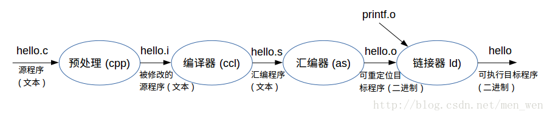

## C编译过程



### 示例代码

```c
#include <stdio.h>
#include <stdlib.h>

int main()
{
    printf("Hello world!\n");
    return 0;
}
```

### 预处理

**预处理（Preprocessing）**：GCC 首先调用预处理程序 cpp 进行预处理，在预处理过程中，.c 文件中的文件包含（include）、预处理语句（e.g. 宏定义 define 等）进行分析，并替换成为真正的内容。

1. 执行所有的预处理器指令，并且展开所有的宏定义。
2. 删除所有注释。
3. 添加行号和文件标识，以便编译时产生调试用的行号及编译错误警告行号。
4. 保留所有的 `#pragma` 预处理器指令，后续编译过程需要使用它们。

```shell
gcc -E -I . hello.c -o hello.i
```

- -E 是让编译器在预处理之后就退出
- -I 指定头文件目录
- -o 指定输出文件名

**hello.i**

```c
....
extern int rpmatch (const char *__response) __attribute__ ((__nothrow__ , __leaf__)) __attribute__ ((__nonnull__ (1))) ;
# 967 "/usr/include/stdlib.h" 3 4
extern int getsubopt (char **__restrict __optionp,
        char *const *__restrict __tokens,
        char **__restrict __valuep)
     __attribute__ ((__nothrow__ , __leaf__)) __attribute__ ((__nonnull__ (1, 2, 3))) ;
# 1013 "/usr/include/stdlib.h" 3 4
extern int getloadavg (double __loadavg[], int __nelem)
     __attribute__ ((__nothrow__ , __leaf__)) __attribute__ ((__nonnull__ (1)));
# 1023 "/usr/include/stdlib.h" 3 4
# 1 "/usr/include/aarch64-linux-gnu/bits/stdlib-float.h" 1 3 4
# 1024 "/usr/include/stdlib.h" 2 3 4
# 1035 "/usr/include/stdlib.h" 3 4

# 3 "hello.c" 2


# 4 "hello.c"
int main()
{
    printf("Hello world!\n");
    return 0;
}
```

### 编译

**编译（ompilation）**：对预处理完的文件进行一系列的词法分析，语法分析，语义分析及优化后生成相应的汇编代码。

- **词法分析**：解析代码的 Tokens。
- **语法分析**：建立抽象语法树。
- **语义分析**：编译器通过语法树来理解代码的含义。检测出非法的语义。

```shell
gcc -S -I . hello.i -o hello.s
```

- -S 让编译器在编译之后停止

**hello.s**

```c
....
main:
.LFB6:
        .cfi_startproc
        stp     x29, x30, [sp, -16]!
        .cfi_def_cfa_offset 16
        .cfi_offset 29, -16
        .cfi_offset 30, -8
        mov     x29, sp
        adrp    x0, .LC0
        add     x0, x0, :lo12:.LC0
        bl      puts
        mov     w0, 0
        ldp     x29, x30, [sp], 16
        .cfi_restore 30
        .cfi_restore 29
        .cfi_def_cfa_offset 0
        ret
        .cfi_endproc
.LFE6:
        .size   main, .-main
        .ident  "GCC: (Ubuntu 11.4.0-1ubuntu1~22.04) 11.4.0"
        .section        .note.GNU-stack,"",@progbits
```

### 汇编

**汇编（Assembly）**：对汇编代码进行处理，生成处理器能识别的指令，保存在后缀为 .o 的目标文件中。由于每一个汇编语句几乎都对应一条处理器指令，因此，汇编过程相对于编译过程比较简单。通过调用 Binutils 工具中的汇编器 as 根据汇编指令和处理器指令的对照表一一翻译即可。一般来讲，.S 文件和 .s 文件经过预处理和汇编之后都会生成以 .o 的目标文件。

当程序由多个源代码文件构成时，每个文件都要先完成汇编工作，生成 .o 目标文件后，才能进入下一步的链接工作。

**注意**：目标文件已经是最终程序的某一部分了，但是在链接之前还不能执行。
**注意**：hello.o 目标文件为 ELF（Executable and Linkable Format）格式的可重定向文件。

```shell
gcc -c hello.s -o hello.o
```

**hello.o**

```shell
$ readelf -a hello.o
ELF 头：
  Magic：   7f 45 4c 46 02 01 01 00 00 00 00 00 00 00 00 00 
  类别:                              ELF64
  数据:                              2 补码，小端序 (little endian)
  Version:                           1 (current)
  OS/ABI:                            UNIX - System V
  ABI 版本:                          0
  类型:                              REL (可重定位文件)
  系统架构:                          AArch64
  版本:                              0x1
  入口点地址：               0x0
  程序头起点：          0 (bytes into file)
  Start of section headers:          784 (bytes into file)
  标志：             0x0
  Size of this header:               64 (bytes)
  Size of program headers:           0 (bytes)
  Number of program headers:         0
  Size of section headers:           64 (bytes)
  Number of section headers:         13
  Section header string table index: 12

节头：
  [号] 名称              类型             地址              偏移量
       大小              全体大小          旗标   链接   信息   对齐
  [ 0]                   NULL             0000000000000000  00000000
       0000000000000000  0000000000000000           0     0     0
  [ 1] .text             PROGBITS         0000000000000000  00000040
       0000000000000020  0000000000000000  AX       0     0     4
  [ 2] .rela.text        RELA             0000000000000000  00000248
       0000000000000048  0000000000000018   I      10     1     8
  [ 3] .data             PROGBITS         0000000000000000  00000060
       0000000000000000  0000000000000000  WA       0     0     1
  [ 4] .bss              NOBITS           0000000000000000  00000060
       0000000000000000  0000000000000000  WA       0     0     1
  [ 5] .rodata           PROGBITS         0000000000000000  00000060
       000000000000000d  0000000000000000   A       0     0     8
  [ 6] .comment          PROGBITS         0000000000000000  0000006d
       000000000000002c  0000000000000001  MS       0     0     1
  [ 7] .note.GNU-stack   PROGBITS         0000000000000000  00000099
       0000000000000000  0000000000000000           0     0     1
  [ 8] .eh_frame         PROGBITS         0000000000000000  000000a0
       0000000000000038  0000000000000000   A       0     0     8
  [ 9] .rela.eh_frame    RELA             0000000000000000  00000290
       0000000000000018  0000000000000018   I      10     8     8
  [10] .symtab           SYMTAB           0000000000000000  000000d8
       0000000000000150  0000000000000018          11    12     8
  [11] .strtab           STRTAB           0000000000000000  00000228
       0000000000000019  0000000000000000           0     0     1
  [12] .shstrtab         STRTAB           0000000000000000  000002a8
       0000000000000061  0000000000000000           0     0     1
```

### 链接

**链接（Linking/Build）**：分为静态链接和动态链接：

- 静态链接：是指在编译阶段直接把静态库加入到可执行文件中去，这样可执行文件会比较大。链接器将函数的代码从其所在地（不同的目标文件或静态链接库中）拷贝到最终的可执行程序中。为创建可执行文件，链接器必须要完成的主要任务是：符号解析（把目标文件中符号的定义和引用联系起来）和重定位（把符号定义和内存地址对应起来然后修改所有对符号的引用）。
- 动态链接：则是指链接阶段仅仅只加入一些描述信息，而程序执行时再从系统中把相应动态库加载到内存中去。
- 动态链接：用动态库进行链接。

```shell
gcc hello.c -o hello
```

- 静态链接：用静态库进行链接。

```shell
gcc -static hello.c -o hello
```

**hello**

```shell
$ objdump -d hello
....
0000000000000754 <main>:
 754:	a9bf7bfd 	stp	x29, x30, [sp, #-16]!
 758:	910003fd 	mov	x29, sp
 75c:	90000000 	adrp	x0, 0 <__abi_tag-0x278>
 760:	911e4000 	add	x0, x0, #0x790
 764:	97ffffb3 	bl	630 <puts@plt>
 768:	52800000 	mov	w0, #0x0                   	// #0
 76c:	a8c17bfd 	ldp	x29, x30, [sp], #16
 770:	d65f03c0 	ret

Disassembly of section .fini:

0000000000000774 <_fini>:
 774:	d503201f 	nop
 778:	a9bf7bfd 	stp	x29, x30, [sp, #-16]!
 77c:	910003fd 	mov	x29, sp
 780:	a8c17bfd 	ldp	x29, x30, [sp], #16
 784:	d65f03c0 	ret
```

### 运行

可以使用  ldd 命令查看链接的动态库。

```shell
$ ./hello 
Hello world!
$ ldd hello
	linux-vdso.so.1 (0x0000ffffa0810000)
	libc.so.6 => /lib/aarch64-linux-gnu/libc.so.6 (0x0000ffffa0600000)
	/lib/ld-linux-aarch64.so.1 (0x0000ffffa07d7000)
```

